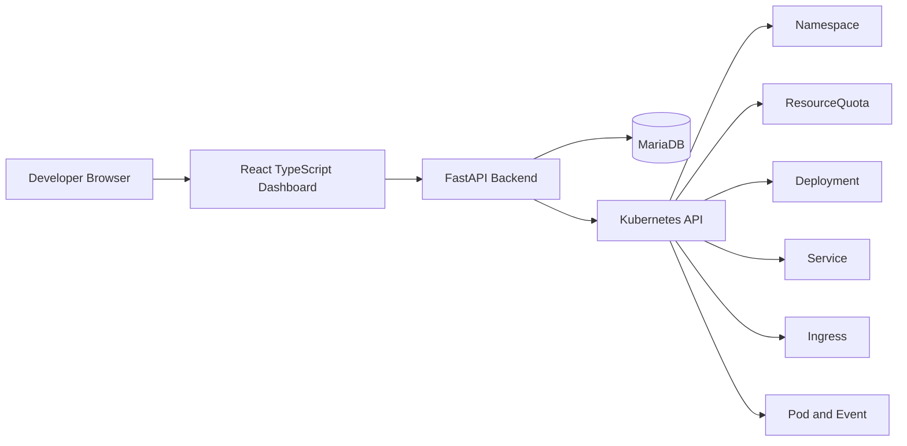

# Private Cloud Self-Service Portal

> A portfolio-ready Internal Developer Platform MVP built with FastAPI, React, MariaDB, and kind Kubernetes. Developers can request a project from a web dashboard, and the platform provisions Kubernetes Namespace, ResourceQuota, Deployment, Service, and optional Ingress resources automatically.

## One-Line Summary

A self-service private cloud portal that turns a simple project request form into managed Kubernetes resources with status visibility, audit logs, and failure diagnosis.

## Problem Definition

In many Kubernetes-based internal platforms, developers need to understand YAML, namespaces, quotas, services, ingress rules, and `kubectl` troubleshooting before they can deploy a small service. Platform teams also need a traceable way to answer these questions:

- Who requested which service and environment?
- Which Kubernetes resources were created?
- Where did provisioning or deletion fail?
- Is the DB project status still aligned with the real Pod state?
- Can a developer see Pod/Event/Audit information without shell access?

This project solves that problem as an MVP: it exposes a simple dashboard and API while keeping the Kubernetes workflow explicit and observable.

## Core Features

- Project request API and dashboard form.
- Automatic Kubernetes resource provisioning:
  - Namespace
  - ResourceQuota
  - Deployment
  - ClusterIP Service
  - optional Ingress when `expose_external=true`
- Project list and detail pages in React.
- Pod status lookup, including container state, waiting reason, restart count, and readiness.
- Kubernetes Event lookup scoped to project-owned resources.
- Audit Log timeline for create, delete, failure, and status sync steps.
- Safe deletion order: Ingress -> Service -> Deployment -> ResourceQuota -> Namespace.
- Live status sync through `POST /api/projects/{id}/sync-status`.
- Local Ingress access guide for kind and ingress-nginx.

## Architecture



Provisioning flow:

```text
Project Request
  -> DB record
  -> Namespace
  -> ResourceQuota
  -> Deployment
  -> Service
  -> Ingress optional
  -> RUNNING
```

Deletion flow:

```text
Ingress -> Service -> Deployment -> ResourceQuota -> Namespace -> DELETED
```

Status sync flow:

```text
POST /api/projects/{id}/sync-status
  -> list project Pods
  -> inspect container waiting reason
  -> inspect Kubernetes Events
  -> update DB project.status
  -> write Audit Log
```

## Tech Stack

| Area | Stack |
| --- | --- |
| Backend | Python, FastAPI, SQLAlchemy, Pydantic |
| Database | MariaDB |
| Frontend | React, TypeScript, Vite, TanStack Query, React Router, Axios |
| Kubernetes | kind, kubernetes Python client, ingress-nginx |
| Infra | Docker Compose, PowerShell scripts |
| Test | unittest, Vitest, Testing Library, oxlint |

## How to Run

### 1. Start MariaDB

```powershell
docker compose -f infra/docker-compose.yml up -d
```

### 2. Create the kind cluster

For local Ingress browser access, use the scripts with host port settings:

```powershell
.\infra\scripts\create-kind-cluster.ps1
.\infra\scripts\install-ingress-nginx.ps1
```

For a basic cluster only:

```powershell
kind create cluster --config infra/kind/kind-config.yaml
```

### 3. Start the backend

```powershell
cd backend
Copy-Item .env.example .env
python -m venv .venv
.\.venv\Scripts\Activate.ps1
pip install -r requirements.txt
uvicorn app.main:app --reload --host 127.0.0.1 --port 8000
```

Health check:

```powershell
Invoke-RestMethod http://127.0.0.1:8000/health
```

OpenAPI docs:

```text
http://127.0.0.1:8000/docs
```

### 4. Start the frontend

```powershell
cd frontend
npm install
Copy-Item .env.example .env
npm run dev
```

Default frontend environment:

```text
VITE_API_BASE_URL=http://127.0.0.1:8000
```

Dashboard URL:

```text
http://127.0.0.1:5173/projects
```

### 5. Validate

```powershell
cd backend
.\.venv\Scripts\python.exe -m unittest discover -s tests
.\.venv\Scripts\python.exe -m compileall app
```

```powershell
cd frontend
npm test
npm run lint
npm run build
```

## API List

| Method | Path | Purpose |
| --- | --- | --- |
| `GET` | `/health` | Check DB and Kubernetes connectivity |
| `GET` | `/api/projects` | List projects |
| `POST` | `/api/projects` | Create a project and provision Kubernetes resources |
| `GET` | `/api/projects/{id}` | Get project detail |
| `GET` | `/api/projects/{id}/pods` | List project Pod and container status |
| `GET` | `/api/projects/{id}/events` | List project-scoped Kubernetes Events |
| `GET` | `/api/projects/{id}/audit-logs` | List project Audit Logs |
| `POST` | `/api/projects/{id}/sync-status` | Sync DB status from live Pod/Event state |
| `DELETE` | `/api/projects/{id}` | Delete Kubernetes resources and mark project deleted |

## Key Implementation Points

- Project-owned Kubernetes resources use labels so Pods and Events can be filtered per project.
- ResourceQuota is created immediately after Namespace creation to enforce tenant boundaries.
- Service and Ingress are separated: ClusterIP for internal traffic, Ingress for optional browser access.
- Audit Log entries are created for lifecycle steps, failures, deletion steps, and status sync.
- `sync-status` closes the gap between resource creation success and actual Pod readiness.
- React Query keeps project, Pod, Event, and Audit Log data independently cached and refreshable.

## Operations and Incident Response Points

- Container waiting reasons such as `ImagePullBackOff`, `ErrImagePull`, and `CrashLoopBackOff` are visible in the dashboard.
- Kubernetes Events provide scheduling, image pull, quota, and controller failure context.
- Audit Logs show the exact order of platform actions and where a workflow failed.
- Deletion follows reverse dependency order to reduce leftover resources.
- Status drift can be corrected through `sync-status`, which updates the DB from live Kubernetes state.

## Troubleshooting

See [docs/troubleshooting.md](docs/troubleshooting.md) for detailed runbooks.

Covered topics:

- kubeconfig context errors
- kind hostPort not applied
- ingress-nginx missing or not ready
- `ImagePullBackOff`
- ResourceQuota exceeded
- CORS errors
- DB column drift after model changes
- Project status mismatch solved by `sync-status`

## Screenshot Scenarios

See [docs/screenshot-scenarios.md](docs/screenshot-scenarios.md) for portfolio capture guidance.

Recommended screenshots:

1. Project list
2. Project creation form
3. `expose_external=true` request
4. Ingress host display
5. Pod Running status
6. `ImagePullBackOff` failure state
7. FAILED status after `sync-status`
8. Audit Log timeline
9. DELETED status after deletion

## Hyundai AutoEver Platform Developer Fit

This project connects directly to the Platform Developer role because it combines backend API development, database modeling, frontend dashboard work, Kubernetes automation, local container infrastructure, network exposure, and operational traceability.

Highlights:

- Python FastAPI platform API.
- SQL/MariaDB persistence for requests, status, and audit logs.
- JavaScript/TypeScript React dashboard.
- Kubernetes resource lifecycle automation.
- Docker/kind local cluster reproducibility.
- Service/Ingress networking understanding.
- Audit Log and status sync for operations visibility.
- Clear extension path to Helm, ArgoCD, GKE, RBAC, and Prometheus/Grafana.

See [docs/job-fit.md](docs/job-fit.md) for a detailed mapping.


## Public Demo Deployment

A GCP GKE Autopilot public demo deployment package is available under `infra/gcp/`.

Live demo:

- Dashboard: http://portal.la-coruna.xyz/projects
- API base: http://portal.la-coruna.xyz/api
- Backend health: http://portal.la-coruna.xyz/health
- Load Balancer IP: http://136.69.1.154/projects
- App wildcard domain: *.apps.la-coruna.xyz
- Shared app ingress IP: 8.230.7.230

It includes:

- backend and frontend Dockerfiles
- GKE manifests for `portal-system`
- MariaDB demo deployment
- least-privilege backend ServiceAccount/RBAC
- public Ingress routing `/api` to FastAPI and `/` to React
- PowerShell scripts for enabling APIs, pushing images, creating GKE Autopilot, deploying, smoke testing, and cleanup

Important safety defaults:

- `DEMO_MODE=true` in GKE
- maximum 3 active demo projects
- maximum 1 replica per project
- allowed images only: `nginx:latest`, `httpd:alpine`, `nginx-not-exist-demo:latest`
- generated namespaces are prefixed with `demo-`
- no GCP credentials, service account keys, kubeconfig, or real `.env` values are committed

Deployment verification completed on GKE Autopilot:

- `portal-backend`, `portal-frontend`, and `portal-mariadb` are running in `portal-system`
- `portfolio-demo` normal deployment was verified with a Running Pod
- `broken-demo` failure deployment was verified with `ImagePullBackOff`
- `POST /api/projects/{id}/sync-status` updated the failed project to `FAILED`
- demo projects were deleted after verification to reduce cost
- custom domain routing was verified for the portal domain
- generated app hosts use `*.apps.la-coruna.xyz`, for example `demo-domain-ingress-staging.apps.la-coruna.xyz`


App routing architecture:

- `portal.la-coruna.xyz` continues to use the portal GCE Ingress Load Balancer.
- `*.apps.la-coruna.xyz` should point to the shared ingress-nginx LoadBalancer IP `8.230.7.230`.
- New app Ingress resources use `ingressClassName=nginx` so they do not create a separate GCE Load Balancer per app.
- Before DNS propagation, app routing can be verified with `curl --resolve` against the shared ingress-nginx IP.
- Existing per-app GCE Ingress resources can still incur cost until explicitly removed.
See [docs/gcp-demo-deployment.md](docs/gcp-demo-deployment.md) for the full deployment and cleanup guide.

## Future Extensions

- Helm: standardize Kubernetes manifests as charts.
- ArgoCD: move provisioning to GitOps and detect drift.
- GKE: run the MVP on a managed Kubernetes environment.
- RBAC: add user/team permissions and approval workflows.
- Prometheus/Grafana: add metrics, dashboards, and SLO views.
- Authentication: integrate SSO or OAuth.
- Multi-tenancy: add team quotas, network policies, and cost tags.
